<div align="center">

# Allstar-City

### Allstar-Scape is back.

**The 2008 RuneScape private server, rebuilt 1:1 on the Lost City engine.**<br>
No download, no Java: you play it in your web browser.


-c0392b)
[](https://github.com/LostCityRS)

[](https://nodejs.org)

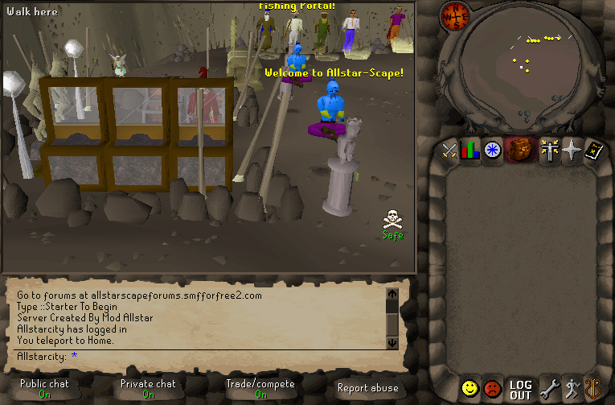

**[Play it](#play-it-locally) · [Screenshots](#screenshots) · [Commands](#commands) · [The original source](#the-original-source) · [How it was built](#how-it-was-built)**

</div>

---

## Remember Allstar-Scape?

*Server created by - Mod Allstar.* If you played RuneScape private servers in 2008 you might remember it:
type `::starter` for 25M and a mountain of runes, spawn whatever you like, chop trees that pay out
coins and never fall, click the thieving stalls until your bank overflows, then `::pkbox`, the
godsword mini-game, and TzTok-Jad standing in the middle of Varrock square.
*"Welcome to Training Made To Own N33bs!"* *"ROFL BETTER LUCK NEXT TIME!"*
*"Go to forums at allstarscapeforums.smfforfree2.com."*

**Allstar-City is that server, running again.** Its original Java source was read line by line and
every behaviour rebuilt on [Lost City](https://github.com/LostCityRS), the open-source RuneScape 2
engine, with the May 2006 (revision 377) game data. Every command, NPC spawn, shop, custom object,
drop table and message comes from the 2008 code, typos included. The quirks came along too: this is
how the server played, not a remake inspired by it.

| | |
| --- | --- |
| **486** NPC spawns from Allstar's `autospawn.cfg` | **7,956** items with Allstar's own item data, plus **154** custom items: godswords, skillcapes, Bandos, Armadyl, defenders, 3rd age... |
| **64** shops with Allstar's prices and colour-coded names | **509** custom world objects: portals, coin trees, stalls, skill chests |
| **~230** `::commands`, player to owner | **43** drop tables and **181** boosted NPCs from `npc.cfg` |
| Allstar's combat: specials, prayers, veng, PvP everywhere outside the safe zones | **634** automated checks against the original's behaviour |

## Screenshots

<table>
<tr>
<td width="50%">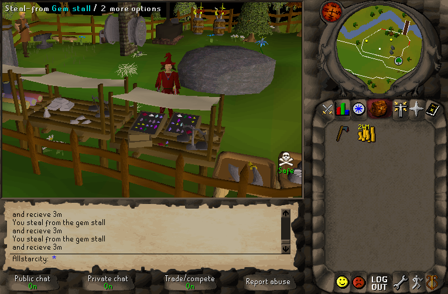<br><sub><b>The Skill Area</b> (<code>::skill</code>): stalls, coin trees, skill chests, agility and smithing in one place.</sub></td>
<td width="50%">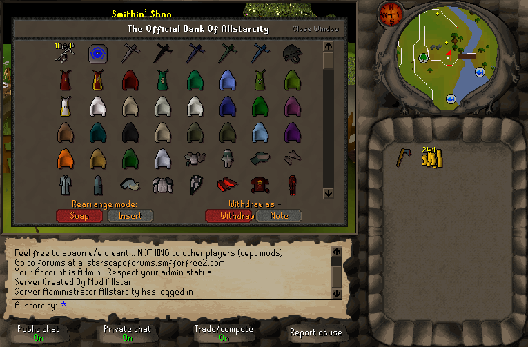<br><sub><b>The Official Bank Of <i>you</i></b>, here full of Allstar's custom items.</sub></td>
</tr>
<tr>
<td width="50%">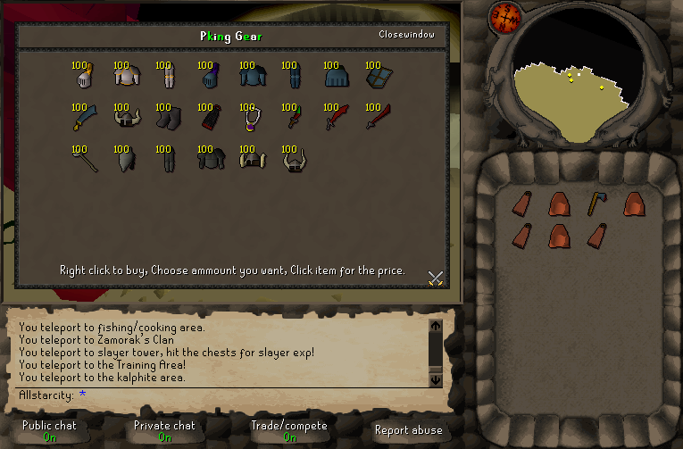<br><sub><b>64 shops</b>, with Allstar's colour-coded names and "Buy" by right-click.</sub></td>
<td width="50%">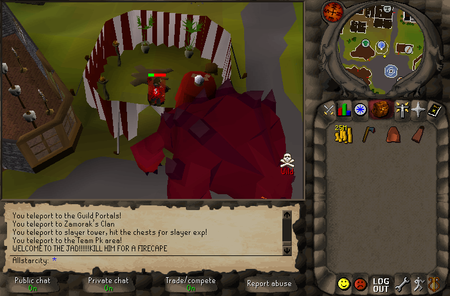<br><sub><b><code>::jad</code></b>: "WELCOME TO THE JAD!!!!!!KILL HIM FOR A FIRECAPE".</sub></td>
</tr>
</table>

<details>
<summary><b>More screenshots</b> (22): every teleport, the Skill Area and the welcome screen</summary>
<br>

<table>
<tr>
<td width="50%">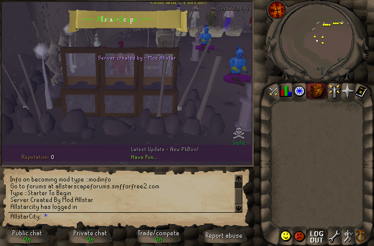<br><sub>The welcome screen: "Server created by - Mod Allstar".</sub></td>
<td width="50%">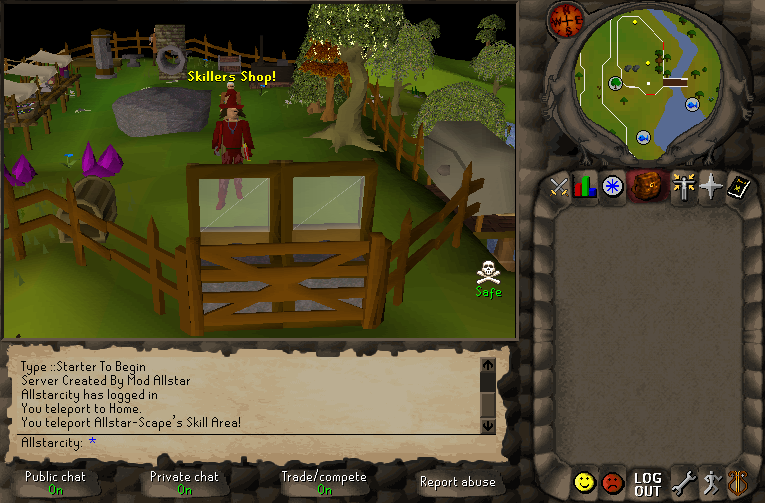<br><sub><code>::skill</code>: Allstar-Scape's Skill Area.</sub></td>
</tr>
<tr>
<td width="50%">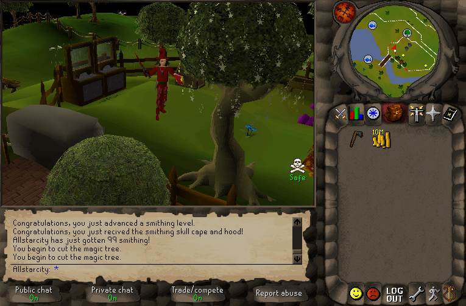<br><sub>Trees pay coins and never fall.</sub></td>
<td width="50%">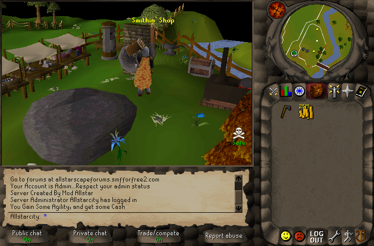<br><sub>"You Gain Some Agility, and get some Cash".</sub></td>
</tr>
<tr>
<td width="50%">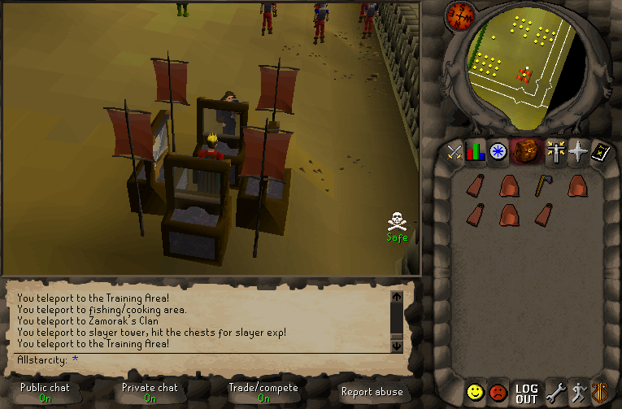<br><sub><code>::train</code>: "Welcome to Training Made To Own N33bs!"</sub></td>
<td width="50%">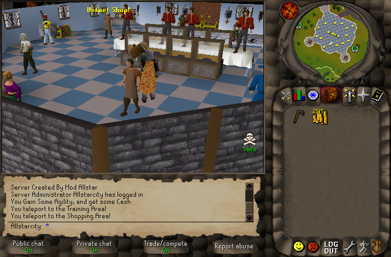<br><sub><code>::shops</code>: the Shopping Area.</sub></td>
</tr>
<tr>
<td width="50%">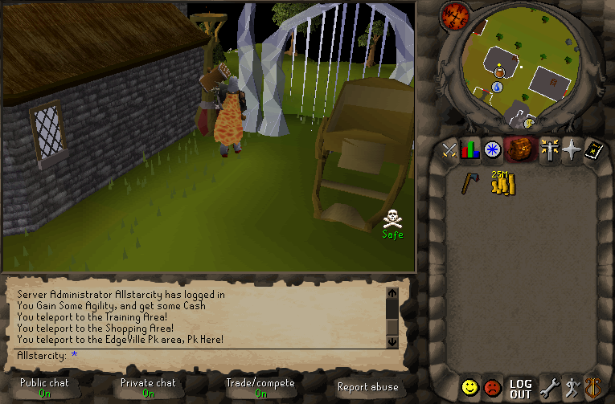<br><sub><code>::edge</code>: Edgeville PK.</sub></td>
<td width="50%">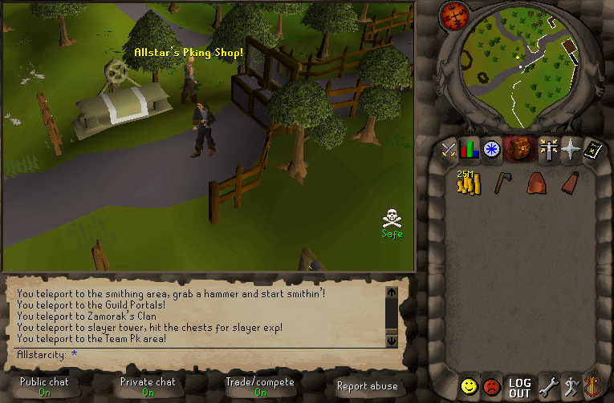<br><sub><code>::teampk</code>: Allstar's Pking Shop at Team PK.</sub></td>
</tr>
<tr>
<td width="50%">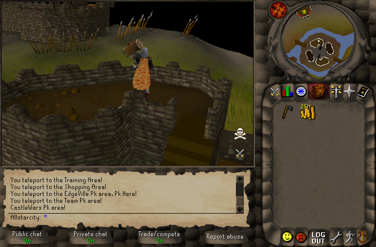<br><sub><code>::cwars</code>: Castle Wars PK.</sub></td>
<td width="50%">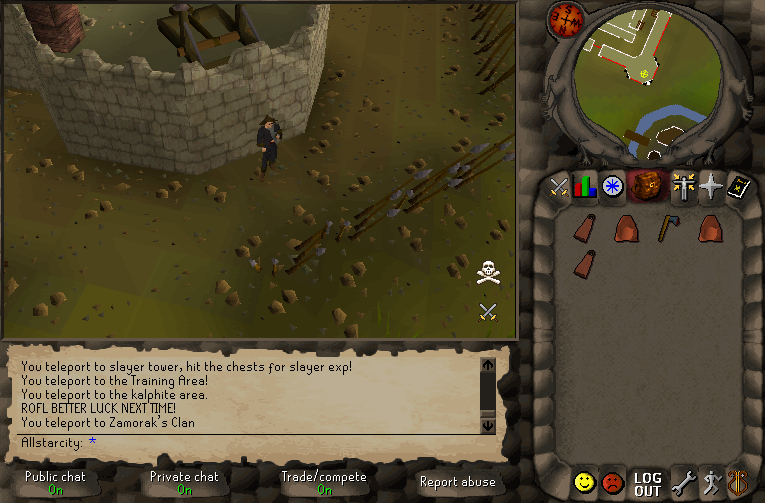<br><sub><code>::zammy</code>: Zamorak's Clan, free robes included.</sub></td>
</tr>
<tr>
<td width="50%">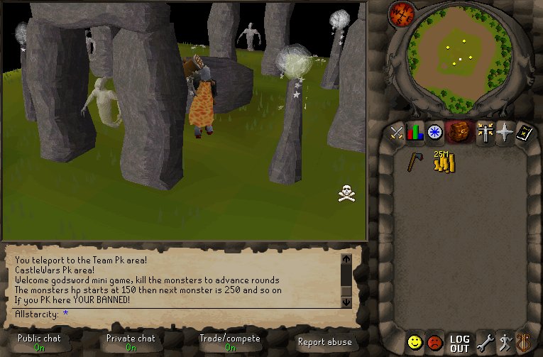<br><sub><code>::gsmini</code>: "Welcome godsword mini game, kill the monsters to advance rounds".</sub></td>
<td width="50%">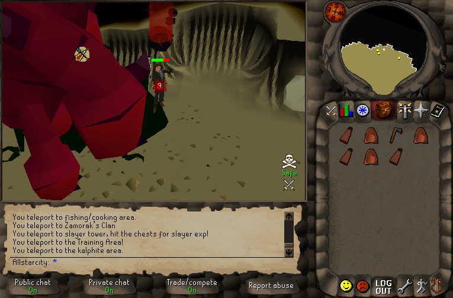<br><sub><code>::kqueen</code>: the Kalphite lair.</sub></td>
</tr>
<tr>
<td width="50%">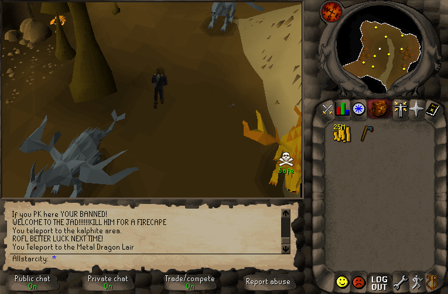<br><sub><code>::drags</code>: the metal dragon lair.</sub></td>
<td width="50%">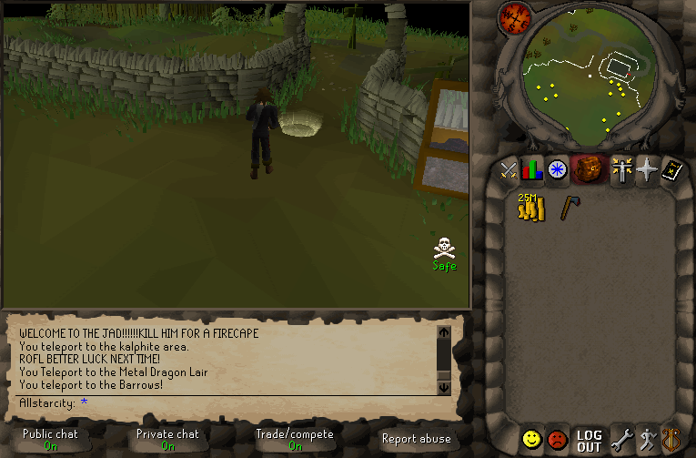<br><sub><code>::barrows</code>: the Barrows brothers.</sub></td>
</tr>
<tr>
<td width="50%">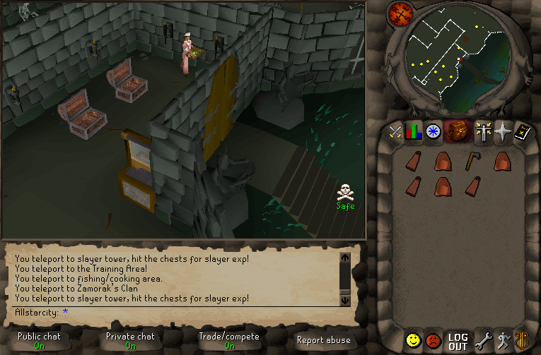<br><sub><code>::slayer</code>: "Click the chests for slayer exp".</sub></td>
<td width="50%">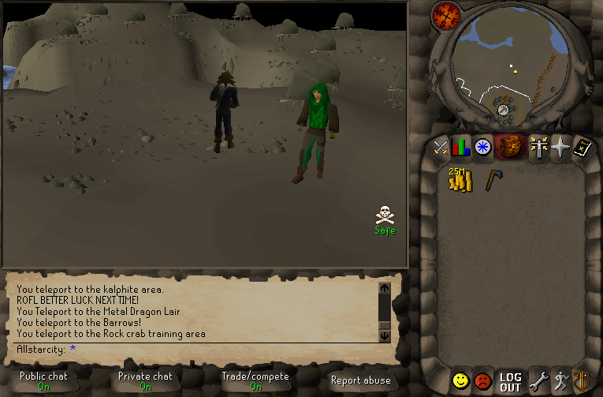<br><sub><code>::relleka</code>: rock crabs.</sub></td>
</tr>
<tr>
<td width="50%">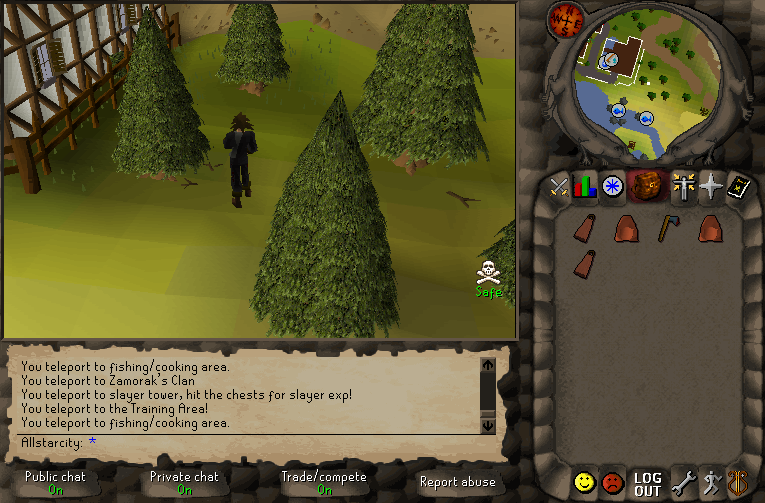<br><sub><code>::cather</code>: fishing and cooking.</sub></td>
<td width="50%">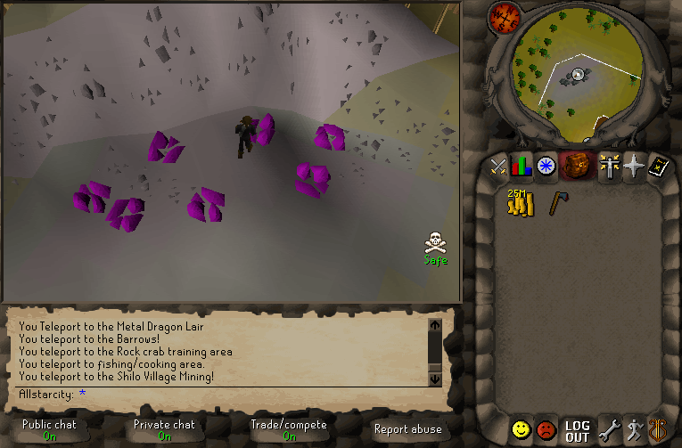<br><sub><code>::mining</code>: Shilo Village mining.</sub></td>
</tr>
<tr>
<td width="50%">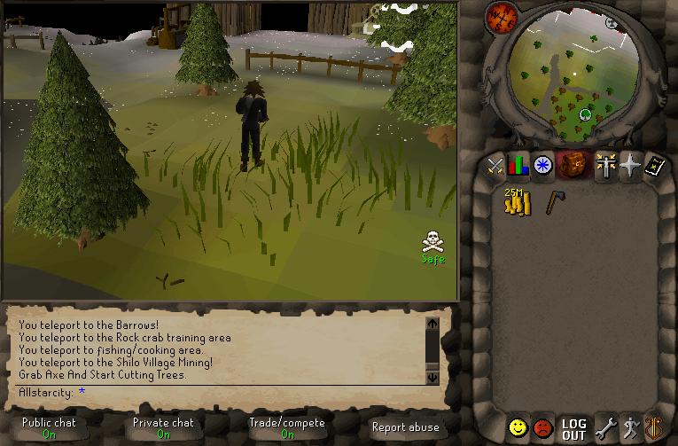<br><sub><code>::wc</code>: "Grab Axe And Start Cutting Trees."</sub></td>
<td width="50%">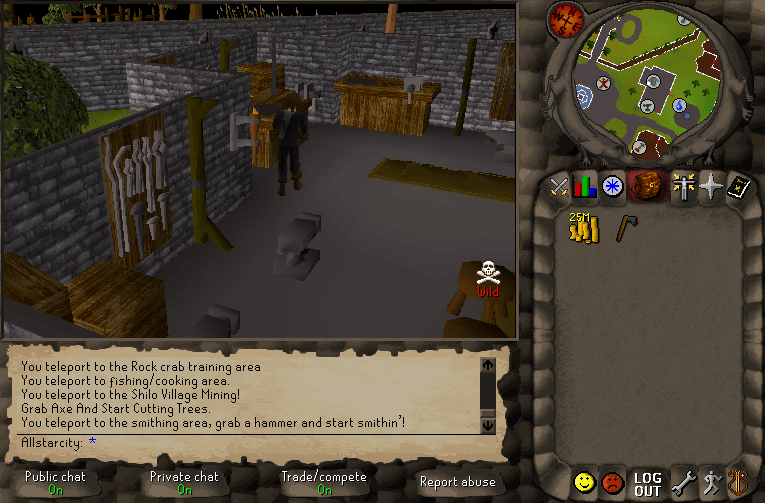<br><sub><code>::smith</code>: "grab a hammer and start smithin'!"</sub></td>
</tr>
<tr>
<td width="50%">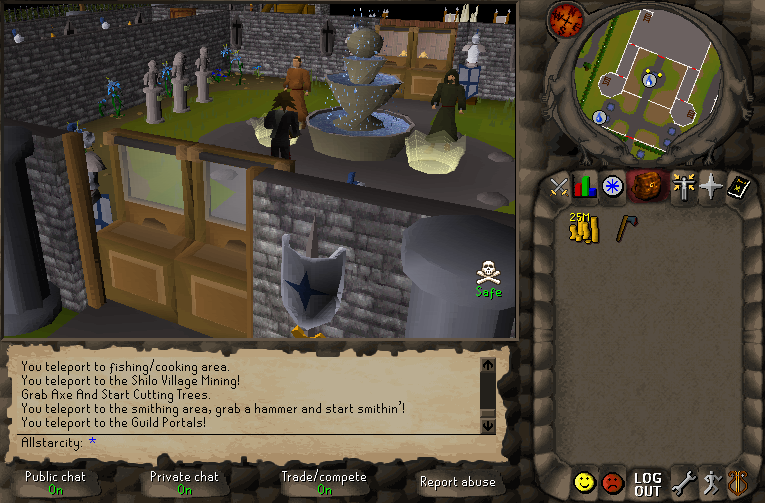<br><sub><code>::guilds</code>: the Guild Portals.</sub></td>
<td width="50%">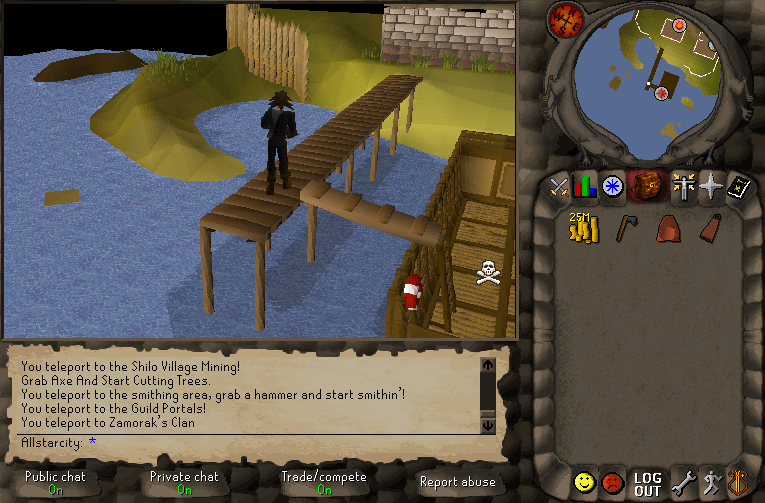<br><sub><code>::pest</code>: Pest Control.</sub></td>
</tr>
</table>

</details>

## Play it locally

You need [Node.js 24 or newer](https://nodejs.org) and [Git](https://git-scm.com). That's all: the
server serves the game client itself.

```bash
git clone https://github.com/oldm8clint/Allstar-City.git
cd Allstar-City/engine
npm start
```

The first start installs the dependencies and builds the game cache, which takes a few minutes. When
the console says **World ready**, open the address it prints:

- Windows and macOS: **http://localhost/rs2.cgi**
- Linux: **http://localhost:8888/rs2.cgi**

Log in with any name and password: a new name makes a new character. Then type `::starter`.

Stop the server with **Ctrl+C** (it saves every player first). Later starts take seconds.

**Another program already uses the port?** Create `engine/.env` with free ports and start again:

```
WEB_PORT=8080
NODE_PORT=43594
WEB_MANAGEMENT_PORT=8898
```

**Be the owner.** Create `engine/data/allstar/owners.txt` with your character's name on its own
line, in lowercase with spaces as `_` (for example `mod_allstar`), then restart the server and log in:
you get Allstar's rank 3 and every command below. A local server is a development world, so Lost
City's developer commands (such as `::setstat`) work too.

**Host it for your friends.** Production settings, real passwords, the owner rank, free tunnels
(no router setup) and backups: [`allstar/HOSTING.md`](allstar/HOSTING.md).

## Commands

Typed in the chat box, exactly as in 2008.

### Teleports (everyone)

| Command | Where | Command | Where |
| --- | --- | --- | --- |
| `::home` | Home, the portal hub | `::skill` | Allstar-Scape's Skill Area |
| `::train` | The Training Area | `::shops` | The Shopping Area |
| `::edge` | Edgeville PK | `::pkbox` | The PkBox |
| `::teampk` | Team PK, north of Varrock | `::cwars` | Castle Wars PK |
| `::zammy` | Zamorak's Clan (free hood and cloak) | `::gsmini` | The godsword mini-game |
| `::jad` | TzTok-Jad, in Varrock square | `::kqueen` | The Kalphite lair |
| `::drags` | The metal dragon lair | `::barrows` | The Barrows brothers |
| `::slayer` | Slayer Tower | `::relleka` | Rock crabs |
| `::cather` | Catherby fishing and cooking | `::mining` | Shilo Village mining |
| `::wc` | Woodcutting | `::smith` | Smithing |
| `::guilds` | The guild portals | `::pest` | Pest Control |

### The Player controls tab

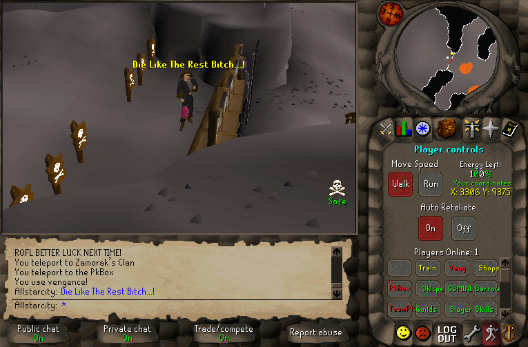

Allstar-Scape turned the emote buttons on the **Player controls** tab into one-click teleports:
Train, Shops, PkBox, GSMINI, Barrow, TeamPK, Guilds, Slayer, Skills and Mining (the unlabelled first
button goes home). **Veng** casts Allstar's vengeance, as in the picture at the PkBox, and
**Sklcpe** performs your skillcape's emote.

<br clear="right">

### Everyone

| Command | What it does |
| --- | --- |
| `::starter` | The Allstar-Scape Starter Package: 25M coins, 15,000 manta rays, an obsidian maul and 20,000 of every rune. Once per character. |
| `::players` | Who's online |
| `::yell <message>` | Talk to the whole server |
| `::tell <name> <message>` | Private message (spaces in names as `_`) |
| `::rep <name>` | Give a reputation point, shown on the welcome screen |
| `::mypk` | Your PK points, kills and deaths |
| `::mystats` | Your account details and total level |
| `::mypos` | Your coordinates |
| `::suggest <idea>` | Send a suggestion to the owner |
| `::serverpanel` | Turn the server panel on or off |
| `::char` | Change your look (`::male` and `::female` for a quick swap) |
| `::empty` | Empty your inventory. Careful. |
| `::info`, `::modinfo`, `::questmenu`, `::slayerinfo`, `::theifmenu`, `::castlewars`, `::armorhelp`, `::fishing`, `::smeltingmenu`, `::servermenu`, `::updates` | Allstar's help scrolls, spelling and all |

### Moderators (rank 1)

| Command | What it does |
| --- | --- |
| `::alert <text>` | Server-wide announcement |
| `::az` | Teleport to the Mod & Admin Zone |
| `::banuser <name>` | Ban a player |
| `::xteleto <name>` | Teleport to a player |
| `::sit` | Sit down |
| `::emote <id>` | Play any animation |
| `::sweet`, `::mod`, `::food`, `::notedbarrows` | Staff kits: gear, "The Allstar-Scape, ModLook package!", manta rays, and a noted set of every Barrows piece |

### Administrators (rank 2)

| Command | What it does |
| --- | --- |
| `::pickup <id> <amount>` | Spawn any item, id as five digits: `::pickup 04151 1` |
| `::rich` | A set of party hats |
| `::pure`, `::master` | Experience packages |
| `::god`, `::godoff` | Float around with unlimited run energy |
| `::pnpc <id>`, `::normal` | Turn into an NPC, and back |
| `::xteletome <name>` | Teleport a player to you |
| `::tele xxxx,yyyy` | Teleport to coordinates |
| `::unban <name>` | Lift bans (it clears the whole ban list, as it always did) |
| `::macrowarn <name>` | A macro warning: a black mark shown at every login |
| `::checkip <name>` | A player's IP address |
| `::gfx <id>` | Play a graphic |

### Owners (rank 3)

| Command | What it does |
| --- | --- |
| `::m` | 999,999,999 coins (so does every other command that starts with `m`) |
| `::giveadmin <name>`, `::givemod <name>`, `::demote <name>` | Set ranks |
| `::lupdate <text>` | Latest-update announcement |
| `::kick <name>`, `::reboot` | Kick a player, or everyone |
| `::ipban <name>` | Ban a player's IP address |
| `::update <seconds>` | System update countdown, then shut down |
| `::alltome` | Teleport everyone to you |
| `::eat <name>` | Eat a player |
| `::bank` | Open your bank anywhere |
| `::npc <id>`, `::a` | Spawn an NPC; `::a` spawns a King Black Dragon |
| `::xslime <name>` | Turn a player into a pig |
| `::snowingzz 1`, `::snowingzz 2`, `::dust`, `::nosnow` | Weather |
| `::interface <id>`, `::inter <id>`, `::make <id> <face>`, `::newhead <n>`, `::follownpc <index>`, `::unpc`, `::mypos 2`, `::guardz` | Owner debug tools |

A few commands belong to 2008 staff names rather than ranks (`Mod Allstar`'s `::giveowner`,
`::hide` and `::show`, among others); [`allstar/HOSTING.md`](allstar/HOSTING.md) explains how to
keep them safe on a public server.

> Allstar-Scape also had its *secret commands quest* (`::questmenu`), and a few commands that are
> not what they seem. They're all still here. Type carefully.

## What's in it

- **The world**: every NPC and object Allstar placed, the home portal hub and the areas it locked off.
- **Skilling, Allstar style**: coin trees, thieving stalls, skill chests, runecrafting altars, the
  agility pipe, fishing, mining and smithing spots, god capes and skillcapes.
- **Shops**: all 64, with Allstar's prices, sell rules and colour-coded names.
- **Items**: Allstar's data for all 7,956 items, the bank ("The Official Bank Of ..."), trading,
  food, potions and bones.
- **Custom items**: 154 items from 2007-08 RuneScape that Allstar added by id: godswords,
  skillcapes and hoods, the dragon full helm, the dragonfire shield, Bandos, Armadyl, defenders and
  3rd age, with models converted from the RuneScape cache.
- **NPCs**: dialogues, bankers, teleporting NPCs, pickpocketing, quests and clue scrolls.
- **Combat**: Allstar's NPC stats and drop tables, the drop-teleport godsword mini-game, special
  attacks, prayers, poison, magic, veng, and PvP with PK points everywhere outside the safe zones.
- **Staff tools**: ranks, bans, IP bans, macro warnings, kicks, announcements, system updates and
  weather.
- **The little things**: the welcome screen, the server panel, reputation, 99 broadcasts, the
  level-up messages and "ROFL BETTER LUCK NEXT TIME!".

## The original source

The complete **Allstar-Scape v2 server source** is in [`allstar/legacy`](allstar/legacy), as it was
in 2008: `client.java`, `NPCHandler.java`, `PlayerHandler.java`, `item.cfg`, `npc.cfg`,
`autospawn.cfg`, `shops.cfg` and the rest of the Moparscape-era 317 Java server. Player saves and
logs were removed. If you have been looking for the Allstar-Scape source: this is it.

## How it was built

1. **Read the original.** The Java source is the specification. It was catalogued, with line
   references, into behaviour reports in [`allstar/spec`](allstar/spec): every command, NPC and
   item handler, object, button, dialogue, drop table and rule.
2. **Generate the data.** Generators in [`allstar/tools`](allstar/tools) turn Allstar's data files
   into Lost City configs and maps. Custom item models are converted from the RuneScape cache.
3. **Rebuild the gameplay** as RuneScript in
   [`content/scripts/allstar`](content/scripts/allstar), replacing Lost City's authentic 2006
   gameplay wherever Allstar-Scape did something else.
4. **Extend the engine** where Allstar needed it: 500 ms game cycles, Allstar's XP curve and combat
   model, NPCs above 255 hitpoints, `::command` hooks, ban lists and hosting behind a tunnel. The
   revision 377 game data runs on Lost City's revision 289 engine and web client, which were
   extended with the 377 formats and client behaviour. Details: [`allstar/PORTING.md`](allstar/PORTING.md).
5. **Test it.** A headless bot in [`allstar/tests`](allstar/tests) speaks the game protocol and
   plays through 634 checks in nine suites.

| Path | What |
| --- | --- |
| `engine/` | Lost City Engine-TS with Allstar-City's engine changes |
| `webclient/` | Lost City Client-TS, the browser client (built into `engine/public/client`) |
| `content/` | The revision 377 game data and the Allstar-City content (`content/scripts/allstar`) |
| `allstar/legacy/` | The original Allstar-Scape v2 source |
| `allstar/spec/` | What the original did, in detail |
| `allstar/tools/` | Data generators, the model converter, `setrank.mjs` |
| `allstar/tests/` | The test bot and test suites |
| `docs/screenshots/` | The pictures above |

### Development

- Run a test suite while the server runs: `cd engine`, then `npx tsx ../allstar/tests/login.test.ts`
  (also `commands`, `combat`, `npcs`, `objects`, `items`, `shops`, `customitems`, `ui`).
- Regenerate the data from Allstar's files: `node allstar/tools/generate.mjs`.
- Rebuild the web client ([Bun](https://bun.sh) needed): `node allstar/tools/build-webclient.mjs`.
- Porting guide: [`allstar/CONTRIBUTING.md`](allstar/CONTRIBUTING.md).

## Credits

- **Mod Allstar** and the Allstar-Scape staff, for the 2008 server.
- **[Lost City](https://github.com/LostCityRS)**, for the engine, the web client and the revision 377
  game data (MIT licensed: `engine/LICENSE`, `webclient/LICENSE`, `content/LICENSE`).
- RuneScape is a trademark of Jagex Ltd. This is a non-commercial preservation project, not
  affiliated with or endorsed by Jagex.
